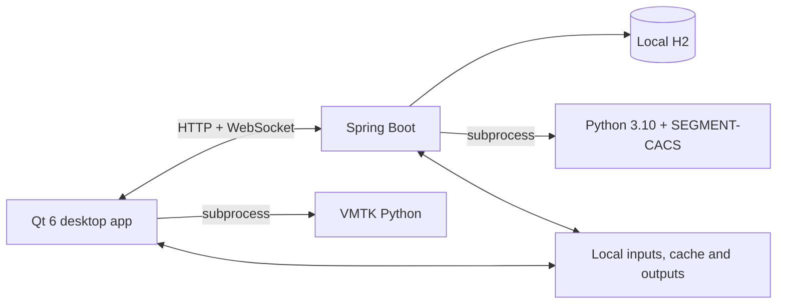

# Coronary Calcium Platform

Windows desktop software for local coronary artery calcium (CAC) analysis,
mask review/editing, and experimental vessel visualization.

Current release baseline:

```text
Branch: release/v0.6.10-portable-windows
Commit: e217565e15e49a8a41ad781bd80eba033931bb51
```

## What it does

### Local CAC analysis

1. The user selects a cardiac CT DICOM series.
2. The Qt application creates a job through the local Spring Boot backend.
3. The backend launches the private Python 3.10 environment and
   SEGMENT-CACS model on CPU.
4. The result, CT volume, and AI mask return to the Qt viewer.
5. The user can review the three MPR views and 3D view, edit a working mask,
   save it, and recalculate the Agatston score.

The supported local workflow uses an H2 database and does not require
PostgreSQL, Kafka, Redis, or Docker.

### Direct NIfTI and vessel visualization

The **Load Multi-Structure** workflow directly loads:

- a CT NIfTI file;
- a categorical segmentation NIfTI file.

It does not run SEGMENT-CACS or create a normal backend inference job. The user
can select a numeric label and connected component, then launch the separate
VMTK Python process to generate centerlines and vessel views.

The popup provides Curved CPR as the default view, Straightened MPR as an
optional view, and a cross-section view on the right.

> The vessel/CPR workflow is an experimental visualization feature and has not
> been established as a clinically validated CPR implementation.

## Architecture



- `qt-cac-app/`: UI, MPR/3D viewer, mask editing, direct NIfTI loading, and
  vessel display.
- `cac-backend/`: local job API, H2 persistence, Python execution, and
  Save/Recalculate flow.
- `python-worker/`: CAC inference CLI, Agatston recalculation, and VMTK vessel
  processing.
- `tools/`: repeatable local backend start/stop scripts.
- `packaging/windows/`: portable Windows packaging and privacy checks.

Qt uses C++ VTK. VMTK uses Python VTK in a separate process, so the two VTK
runtimes do not share one address space.

## Development start

Prerequisites:

- Java 21;
- Qt 6 and a compatible C++ VTK build;
- isolated CAC Python 3.10 environment;
- SEGMENT-CACS source and checkpoint;
- separate VMTK Python environment only for vessel processing.

Build the backend:

```powershell
Set-Location .\cac-backend
.\mvnw.cmd clean test
.\mvnw.cmd clean package
Set-Location ..
```

Start it with explicit external paths:

```powershell
powershell.exe -NoProfile -ExecutionPolicy Bypass `
  -File .\tools\Start-Local-CAC.ps1 `
  -SegmentCacsRoot '<SEGMENT-CACS-directory>' `
  -ModelPath '<checkpoint-file>' `
  -PythonExecutable '<CAC-python.exe>'
```

Continue only after the script prints:

```text
READY: Local CAC backend health is UP.
```

Build and run Qt:

```powershell
cmake -S .\qt-cac-app -B .\qt-cac-app\build\local-release `
  -G Ninja -DCMAKE_BUILD_TYPE=Release `
  -DCMAKE_PREFIX_PATH='<Qt-directory>' `
  -DVTK_DIR='<VTK-CMake-directory>'
cmake --build .\qt-cac-app\build\local-release
.\qt-cac-app\build\local-release\qt-cac-app.exe
```

Stop only the backend started by the local script:

```powershell
powershell.exe -NoProfile -ExecutionPolicy Bypass `
  -File .\tools\Stop-Local-CAC.ps1
```

Detailed local script usage is in
[`tools/LOCAL_WINDOWS_DEV.md`](tools/LOCAL_WINDOWS_DEV.md).

## Tests

Backend:

```powershell
Set-Location .\cac-backend
.\mvnw.cmd test
```

Vessel processing:

```powershell
& '<VMTK-python.exe>' -m pytest `
  .\python-worker\tests\test_vessel_straightening.py -q
```

There is no automated Qt GUI test suite. MPR alignment, editing, 3D planes,
NIfTI labels, vessel paths, and CPR views require manual visual regression.

## Important limitations

- Normal model inference accepts DICOM and runs on CPU.
- Direct NIfTI loading is a separate review/visualization workflow.
- Vessel/CPR output is experimental and not clinically validated.
- The local backend has no authentication; keep it bound to `127.0.0.1`.
- `reportPath` is stored/displayed, but report generation is not implemented.
- Model redistribution rights must be confirmed before public distribution.

## Data and privacy

Never commit or package patient data, masks, generated centerlines/CPR,
runtime H2 databases, caches, logs, model checkpoints, or private runtime
environments. Sanitize patient identifiers and local paths in bug reports.

Windows portable packaging details are in
[`packaging/windows/README.md`](packaging/windows/README.md). The recorded
v0.6.10 build checks are in
[`packaging/windows/pipeline/BUILD_RECORD.md`](packaging/windows/pipeline/BUILD_RECORD.md);
they were not rerun during this documentation-only update.
